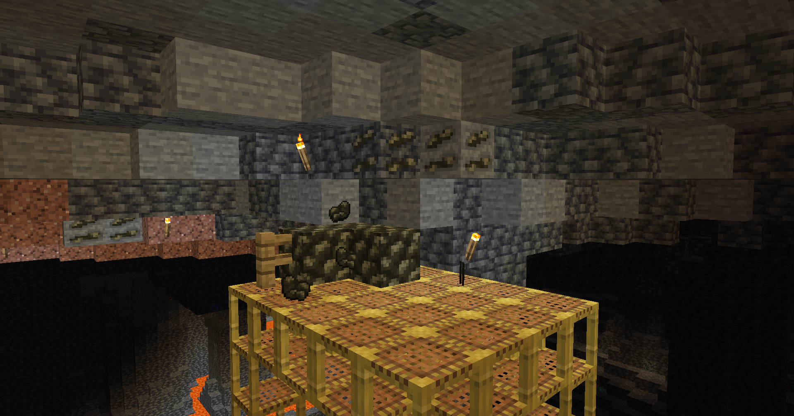
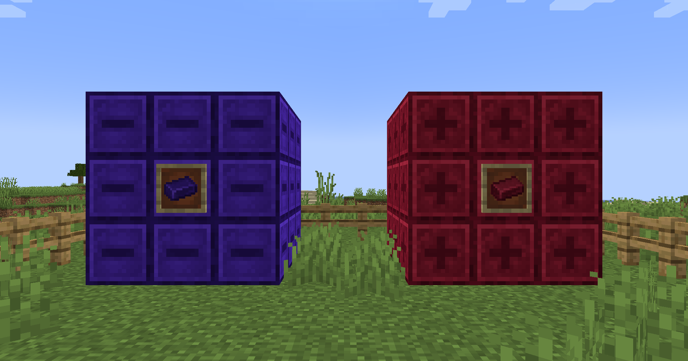
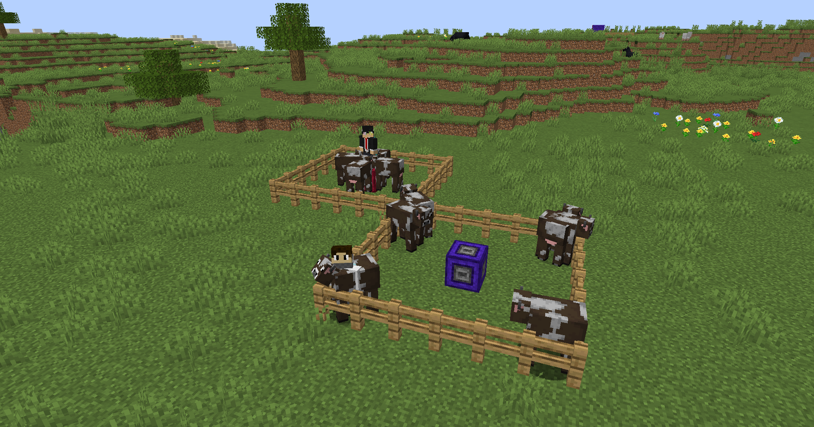

***Fabric also requires [Fabric API](https://modrinth.com/mod/fabric-api) and [Forge Config API Port](https://modrinth.com/mod/forge-config-api-port)!***

---

## About 📖

This mod adds blocks and items related to magnets. These can be used as to make
farming easier, create new redstone contraptions or just to annoy your friends!

Magnets are made by a new ore:

**Magnetite!**

Magnetite ore generates similar to iron ore, it's the one of the key materials needed to make magnets.
Yet you can't just use magnetite ingots to make magnets, as they are not
magnetic **...for now!**

If you add some **lapis lazuli** or **redstone** to a **magnetite ingot** you get:

**Blue** and **red magnetite**, ...and now they're magnetic!

**Blue magnetite** has a **minus pole**, this means it'll repel entities
and **red magnetite** has a **plus pole**, it attracts entities!

## Showcase 🖼️

### Block Magnets

They attract/repel entities in a square up to 5 blocks in each direction. 
The range can be changed by right-clicking the block.

### Directional Block Magnets

These magnets attract/repel entities in a line up to 10 blocks long in only one direction.
You can yet again change the range by right-clicking the block.

### Item Magnets

Item magnets fit in inventory and are perfect for picking up many items on the ground or pushing them away.
They work similar to block magnets, but only attract/repel items from the ground.

The range can be changed by sneaking and right-clicking with the item.

## Other 📚

This mod is configurable! You can install [Configured](https://www.curseforge.com/minecraft/mc-mods/configured) to change the config in-game.

Found an issue or do you have feedback? Make an issue on the [issue tracker](https://github.com/Command17/Magnetizing/issues)!

---

## My Other Mods 📦

|  |
|------------------------------------------------------------------------------------------------------------------------------------------------------------------|
|                   |